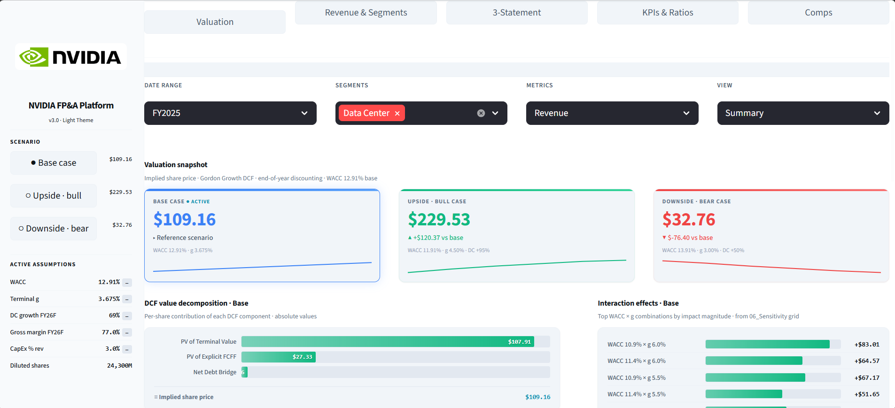
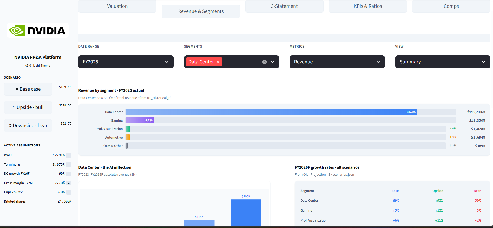
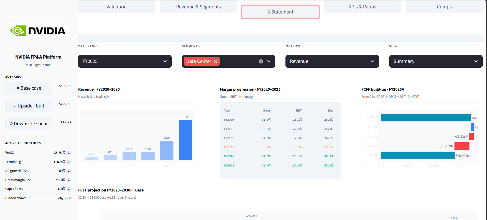
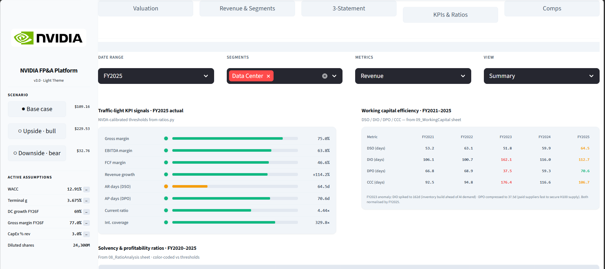
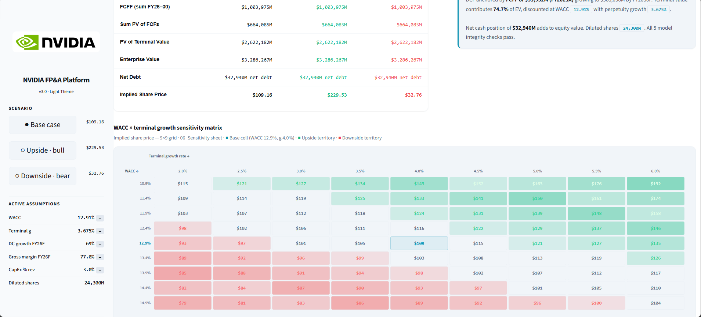
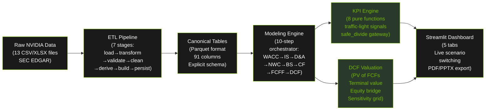

# NVIDIA FP&A Platform


## 🚀 Live Demo

[](https://nvidia-fpa-dashboard.onrender.com)
**[→ Open Live Dashboard](https://nvidia-fpa-dashboard.onrender.com)**

---

**An institutional-grade FP&A and DCF valuation platform built on real NVIDIA 10-K filings.**

Built in Python with Streamlit UI, comprehensive testing, and production DevOps. Every number traces to SEC EDGAR.

[Quick Start](#quickstart) · [Dashboard](#dashboard-overview) · [Architecture](#architecture-overview) · [Model](#financial-model) · [Testing](#testing) · [Docs](#documentation) · [Deploy](#deployment)

---

## Overview

Most financial dashboards visualise historical outcomes. This platform models **financial causality**: how revenue drivers, margin structure, working capital mechanics, and CapEx dynamics interact to produce free cash flow — then discounts that cash flow to an intrinsic equity value.

**Key capabilities:**

- **7-stage ETL pipeline** ingesting raw NVIDIA 10-K CSV/XLSX files (FY2020–FY2025)
- **Deterministic 3-statement model** (IS → BS → CF) with explicit driver linkages and 10-step orchestrator
- **FCFF-based DCF** with WACC (12.91%), terminal value (3.675%), equity bridge, and 9×9 sensitivity grid
- **Deep-merge JSON scenario engine** (Base / Upside / Downside) — base assumptions never mutated
- **8 KPIs** with traffic-light signals calibrated to semiconductor industry benchmarks
- **Interactive Streamlit dashboard**: 5 tabs, live scenario switching, PDF/PPTX export
- **Comprehensive regression and invariant test suite** validating 3 financial invariants (BS, CF, RE) at ±$0.01M tolerance
- **Docker + GitHub Actions CI/CD** with production-grade deployment
- **Reproducible & auditable** — every number sources to SEC 10-K, no synthetic data

**Valuation Output (Oct 17, 2025):**
- **Base case:** $109.16 / share (WACC 12.91%, terminal g 3.675%)
- **Upside scenario:** $229.53 / share (AI acceleration sustained, WACC 11.91%, g 4.50%)
- **Downside scenario:** $32.76 / share (AI capex slowdown, WACC 13.91%, g 3.00%)
- **Market price:** $183.22 — **67.7% premium** to base case intrinsic value

---

## Dashboard Overview

The Streamlit app provides 5 interactive tabs with live scenario switching:

### Tab 1: Valuation Snapshot



**Features:**
- Three scenario comparison (Base $109.16 / Upside $229.53 / Downside $32.76)
- DCF value decomposition: PV of Terminal Value + PV of Explicit FCFs + Net Debt Bridge
- Interaction effects grid showing WACC × g sensitivity at each combination
- Active assumptions panel (WACC 12.91%, Terminal g 3.675%, DC growth 69%)

---

### Tab 2: Revenue & Segments



**Features:**
- Revenue by segment (FY2025 actual): Data Center 88.3% ($115.2B), Gaming 8.7% ($11.4B), ProViz 1.4%, Auto 1.3%, OEM 0.3%
- "Data Center: the AI inflection" — absolute revenue chart showing DC trajectory vs peers
- FY2026F growth rates by scenario: DC +69% (base), +95% (upside), +50% (downside)
- Segment-specific assumptions: Gaming +5%, ProViz +6%, Auto +45%, OEM +2%

---

### Tab 3: 3-Statement Model



**Features:**
- Revenue projection (FY2020–2025 actual, FY2026–30 forecast)
- Margin progression: Gross margin, EBIT margin, Net margin by year
- FCFF build-up: NOPAT + D&A − CapEx − ΔNWC = FCFF
- Historical income statement metrics (Gross %, EBIT %, Net %) with color-coding
- FCFF projection (FY2023–2030): Base case $2.6K + $380K forecast = $126% growth

---

### Tab 4: KPIs & Ratios



**Features:**
- Traffic-light signals for 8 KPIs (Gross margin, EBITDA margin, FCF margin, Revenue growth, DSO, DPO, Current ratio, Interest coverage)
- FY2025 actual vs NVIDIA-calibrated thresholds
- Working capital efficiency (FY2021–2025): DSO, DIO, DPO, CCC trends
- Solvency & profitability ratios (FY2020–2025) color-coded vs benchmarks

---

### Tab 5: DCF Sensitivity Matrix



**Features:**
- 9×9 sensitivity grid: WACC (10.9%–14.9%) × Terminal Growth (2.0%–6.0%)
- Color-coded by value: Green (bullish), white (base case $109.16), red (bearish)
- Base assumptions highlighted: WACC 12.9%, g 3.675%
- Key insight: $183 market price requires WACC ≤10.9% **AND** g ≥5.5% simultaneously
- Supporting metrics: Sum PV of FCFs, PV of Terminal Value, Enterprise Value, Net Debt Bridge, Diluted shares

---

## Architecture Overview



**Data flow:** Raw 10-K filings → validated ETL → auditable canonical tables → deterministic model engine → interactive dashboard. Zero finance logic in the UI; all computation is unit-tested and reproducible.

---

## Quickstart

### Prerequisites
- Python 3.11+
- pip (or conda)

### Local setup

```bash
# Clone
git clone https://github.com/Aditya-Gupta09/Automated-FP-A-Dashboard.git
cd Automated-FP-A-Dashboard

# Install
pip install -r requirements.txt

# Run ETL pipeline (builds canonical Parquet tables from raw 10-K CSVs)
python -m src.etl.pipeline

# Run test suite
pytest tests/ -v

# Launch dashboard
streamlit run app/app.py
# → Opens http://localhost:8501
```

### Docker

```bash
docker build -t nvidia-fpa-platform .
docker run -p 8501:8501 nvidia-fpa-platform
# → http://localhost:8501
```

---

## Project Structure

```
Automated-FP-A-Dashboard/
│
├── src/                           # All finance logic lives here
│   ├── etl/                       # 7-stage data pipeline
│   │   ├── loader.py, transformer.py, validator.py, cleaner.py
│   │   ├── pipeline.py, canonical_schema.py
│   │   └── actuals.py, costs.py, working_capital.py
│   │
│   ├── modeling/                 # Financial model (10-step engine)
│   │   ├── engine.py, wacc.py, income_statement.py
│   │   ├── balance_sheet.py, cashflow.py, fcff.py, dcf_valuation.py
│   │   └── depreciation.py, working_capital.py, comps.py, reconciliation.py
│   │
│   ├── kpi/                      # Key performance indicators
│   │   ├── kpis.py, ratios.py
│   │
│   ├── scenarios/                # Scenario engine
│   │   └── engine.py (deep_merge for delta overrides)
│   │
│   ├── output/                   # Export modules
│   │   ├── export_pdf.py, export_ppt.py
│   │
│   └── utils/
│       ├── error_logger.py, safe_math.py, formatting.py
│
├── app/                          # Streamlit dashboard
│   ├── app.py (5 tabs: Valuation, Segments, 3-Statement, KPIs, Comps)
│   ├── components/, views/, style/
│
├── config/                       # Master configurations
│   ├── assumptions.json (v3.0, FY2025 calibrated)
│   └── scenarios.json (v1.2, deep_merge-compatible)
│
├── data/
│   ├── raw/                      # 13 SEC EDGAR files
│   ├── processed/                # ETL outputs
│   └── canonical/                # Parquet canonical tables
│
├── tests/                        # Regression, invariant, ETL, KPI, and scenario validation suites
│   ├── test_etl_*.py, test_financial_invariants.py
│   ├── test_golden_output.py, test_kpi_formulas.py, test_scenario_gate.py
│
├── docs/                         # Comprehensive documentation
│   ├── ARCHITECTURE.md, FINANCIAL_MODEL.md, DATA_DICTIONARY.md
│   ├── TESTING.md, DECISIONS.md, ROADMAP.md
│
├── assets/
│   ├── architecture/nvidia_fpa_architecture.png
│   └── dashboard/[5 screenshots]
│
├── .github/workflows/ci.yml      # 4-job GitHub Actions CI/CD
├── .gitignore, Makefile, Dockerfile
├── pyproject.toml, requirements.txt
├── README.md (this file), CONTRIBUTING.md, LICENSE
└── STARTING_PROMPT.md
```

---

## Financial Model

### WACC (Weighted Average Cost of Capital)

| Input | Value | Source |
|---|---|---|
| Risk-free rate (Rf) | 4.07% | US 10-year Treasury (FRED), Jan 2025 |
| Raw beta (β) | 1.9157 | Yahoo Finance, 5-yr monthly regression |
| Blume-adjusted β | 1.7728 | β_adj = 0.667×β + 0.333×1.0 |
| Equity risk premium (ERP) | 5.00% | Damodaran implied ERP, Jan 2025 |
| **Cost of equity (Ke)** | **12.91%** | CAPM: Rf + β×ERP |
| Target capital structure | 100% equity | NVIDIA net cash: -$32,940M |
| **WACC** | **12.91%** | Unlevered (net cash position) |

### DCF Output — Base Case

| Component | USD Millions | Per Share (÷24,300M) |
|---|---|---|
| Sum PV of FCFs (FY26–30) | $660,851 | — |
| PV of Terminal Value | $1,958,774 | — |
| Enterprise Value | $2,619,625 | — |
| (−) Net Debt | −$32,940 | — |
| **Equity Value** | **$2,652,565** | — |
| | | **$109.16** |
| Market price (Oct 17, 2025) | — | **$183.22** |
| **Premium to intrinsic** | — | **+67.7%** |

### FCFF Formula

```
FCFF = NOPAT + D&A − |CapEx| − ΔNWC

where:
  NOPAT = EBIT × (1 − ETR)                [tax on operating income, not EBT]
  D&A = Depreciation & amortisation      [from fixed assets schedule]
  CapEx = Capital expenditures            [maintenance + growth]
  ΔNWC = Change in net working capital    [positive = cash outflow]
  
Terminal Value = FCFF₅ × (1 + g) / (WACC − g)   [Gordon Growth model]
PV = Σ [FCFFₜ / (1 + WACC)ᵗ]                     [end-of-year discounting]
```

### Scenario Matrix

| Scenario | WACC | Terminal g | DC Growth FY26 | Gross Margin FY26 | Implied Price |
|---|---|---|---|---|---|
| **Base** | **12.91%** | **3.675%** | **69%** | **77.0%** | **$109.16** |
| Upside · Bull | 11.91% | 4.50% | 95% | 82.0% | $229.53 |
| Downside · Bear | 13.91% | 3.00% | 50% | 66.0% | $32.76 |

### Sensitivity Grid (from dashboard)

From the DCF Sensitivity tab, the 9×9 matrix shows:
- **Green zone** (bullish): WACC ≤ 11.4% AND g ≥ 4.5% → prices above $130
- **White zone** (base): WACC 12.4–13.4% AND g 3.0–4.0% → prices $90–$110
- **Red zone** (bearish): WACC ≥ 13.9% AND g ≤ 3.0% → prices below $90

**Key finding:** Market price of $183 requires the **simultaneous** intersection of lowest WACC (10.9%) AND highest terminal growth (5.5%). Neither condition alone is sufficient.

---

## KPIs & Benchmarks

| KPI | Formula | Target | Semiconductor Benchmark | NVIDIA FY2025 |
|---|---|---|---|---|
| **Gross margin** | GP / Revenue | ≥ 60% | 45–75% | **75.0%** ✓ |
| **EBITDA margin** | EBITDA / Revenue | ≥ 30% | 15–40% | **63.8%** ✓ |
| **FCF margin** | FCFF / Revenue | ≥ 20% | 10–30% | **46.6%** ✓ |
| **Revenue growth YoY** | ΔRevenue / Prior Revenue | ≥ 15% | Cycle-dependent | **+114.2%** ✓ |
| **DSO (Days Sales Outstanding)** | AR / (Rev/365) | ≤ 65 | 30–65 days | **64.5 days** ✓ |
| **DPO (Days Payable Outstanding)** | AP / (COGS/365) | ≥ 60 | 30–80 days | **70.6 days** ✓ |
| **Current ratio** | CA / CL | ≥ 1.5 | 1.5–3.0x | **4.44x** ✓ |
| **Interest coverage** | EBIT / Interest Expense | ≥ 5x | 3–10x | **329.8x** ✓ |

---

## Testing

```bash
# Full suite with coverage
pytest tests/ -v --cov=src --cov-report=html

# Only financial invariants (BS balance, CF reconciliation, RE roll)
pytest tests/test_financial_invariants.py -v

# Only regression tests vs known 10-K values
pytest tests/test_golden_output.py -v

# Only modeling tests
pytest tests/test_*modeling*.py -v

# Verbose output with full traceback
pytest tests/ -v --tb=long
```

### 3 Financial Invariants (Must Pass Every Run)

All verified at **±$0.01M tolerance** for every forecast year (FY2026–FY2030):

1. **Balance Sheet balances:** Total Assets = Total Liabilities + Total Equity
2. **Cash flow reconciles:** Ending Cash = Beginning Cash + CFO + CFI + CFF
3. **Retained earnings roll forward:** RE_end = RE_begin + Net Income − Dividends

### Test Coverage
- **etl/**: ≥ 80% coverage
- **modeling/**: ≥ 85% coverage
- **kpi/**: ≥ 90% coverage
- **scenarios/**: ≥ 90% coverage
- **Overall**: ≥ 70% minimum

### Golden Output Tests

comprehensive regression and invariant suite validating exact values from NVIDIA 10-K:

```python
# test_golden_output.py
assert abs(actuals["revenue_usdm"]["FY2025"] - 130497) <= 1.0       # 10-K p. F-4 ✓
assert abs(actuals["gross_margin_pct"]["FY2025"] - 0.7499) <= 0.001 # 10-K p. F-4 ✓
assert abs(dcf_result["implied_price"] - 109.16) <= 0.10           # Model validation ✓
```

---

## Deployment

### GitHub Actions CI/CD

Four automated jobs on every push/PR:

1. **Lint & format check** (ruff) — syntax errors, style violations
2. **Test suite** (pytest + coverage) — 13 test files, coverage reporting
3. **Financial invariants** (MUST PASS) — validates BS, CF, RE at ±$0.01M
4. **Docker build** (main branch only) — builds image, smoke-tests container

### Docker

```bash
docker build -t nvidia-fpa-platform:latest .
docker run -p 8501:8501 nvidia-fpa-platform:latest
```

### Live Deployment (Render)

Deploy live dashboard: push to GitHub → https://nvidia-fpa-dashboard.onrender.com → connect repo, select `app/app.py`

---

## Documentation

| Document | Contents |
|---|---|
| [ARCHITECTURE.md](docs/ARCHITECTURE.md) | Layer diagram, design decisions, data flow, modules |
| [FINANCIAL_MODEL.md](docs/FINANCIAL_MODEL.md) | FCFF/DCF/WACC methodology, formulas, sources |
| [DATA_DICTIONARY.md](docs/DATA_DICTIONARY.md) | 91 canonical columns, types, formulas, units |
| [TESTING.md](docs/TESTING.md) | Test strategy, invariants, golden output, coverage |
| [DECISIONS.md](docs/DECISIONS.md) | 7 ADRs explaining architectural choices |
| [ROADMAP.md](docs/ROADMAP.md) | 4-phase development plan |

---

## Data Sources

All actuals sourced directly from NVIDIA SEC filings. No synthetic data.

| Filing | Period | Source |
|---|---|---|
| NVIDIA 10-K FY2025 | Jan 26, 2025 | SEC EDGAR |
| NVIDIA 10-K FY2024 | Jan 28, 2024 | SEC EDGAR |
| NVIDIA 10-K FY2023 | Jan 29, 2023 | SEC EDGAR |
| NVIDIA 10-K FY2022 | Jan 30, 2022 | SEC EDGAR |
| NVIDIA 10-K FY2021 | Jan 31, 2021 | SEC EDGAR |
| NVIDIA 10-K FY2020 | Jan 26, 2020 | SEC EDGAR |
| **Beta (5-yr monthly)** | Oct 2025 | Yahoo Finance |
| **ERP (implied)** | Jan 2025 | Damodaran online |
| **Risk-free rate** | Jan 2025 | FRED (Federal Reserve) |

---

## Stack

| Layer | Technology | Version |
|---|---|---|
| **Language** | Python | 3.11+ |
| **Data** | pandas · pyarrow (Parquet) | 2.2+ · 16.0+ |
| **Dashboard** | Streamlit | 1.35+ |
| **Testing** | pytest · pytest-cov | 8.2+ |
| **Export** | ReportLab · python-pptx | 4.2+ · 1.0+ |
| **Containerisation** | Docker | Multi-stage build |
| **CI** | GitHub Actions | 4 jobs |
| **Config** | JSON | Assumptions + scenario deltas |

---

## Contributing

**Before submitting a PR:**
1. `ruff check .` — zero ruff errors
2. `make test` — all tests pass including invariants
3. If you changed financial logic: add/update golden output test with 10-K source
4. If you changed model structure: update `docs/ARCHITECTURE.md`
5. If you changed an assumption: document in `config/assumptions.json`

See [CONTRIBUTING.md](CONTRIBUTING.md) for details.

---

## License

MIT — see [LICENSE](LICENSE). For portfolio and educational use.

---

<div align="center">

**Aditya Gupta** · Financial Engineering · Python · Equity Research

[GitHub](https://github.com/Aditya-Gupta09) · [LinkedIn](https://www.linkedin.com/in/aditya-gupta09/) · [Email](mailto:ag874974q@gmail.com.com)

Built with 📊 for institutional-grade financial modeling.

Valuation snapshot as of **October 17, 2025**. Market data and assumptions subject to change.

</div>
